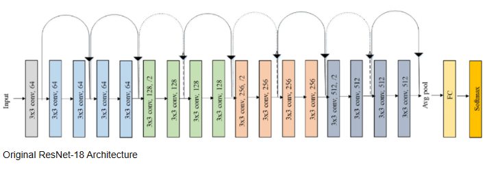

# Resnet 18 with the CIFAR-10 dataset

## Slight modification due to small size of the images (32 x 32) - Initial layer has a 3x3 kernel instead of 7x7

### I've been tuning the model and experimenting with various hyperparameters and am  updating this README with the best performing model and its hyperparameters

### Transforms - random crop with padding of 4, random horizontal flip, to tensor, then normalization

- epochs - 40
- learning rate = 0.1 with cosine annealing with warm restarts with T_0 = 20
- batch size = 128
- optimizer - SGD with momentum 0.9
- loss function - cross entropy loss with label smoothing = 0.1
- device - cuda
- automatic mixed precision (amp) - yes with Grad Scaler
- weight decay = 1e-3
- dropout - 0.5 just prior to the fully connected layer

### With this model I was able to get a test accuracy of 89.86%

### Using Weight and Biases (wandb.ai) to track and log experiments - it's awesome!